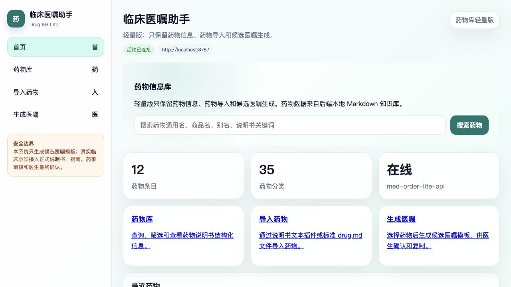

# Med Order Lite

Med Order Lite 是一个本地运行的药物信息管理与候选医嘱生成 Web App。

它适合用于维护本地药物知识库、导入药物说明书信息、查询药物资料，并基于结构化说明书字段生成候选医嘱文本。

> 安全提示：本项目只生成候选医嘱模板，不能替代医生或药师判断，也不能直接作为处方依据。所有药物信息和医嘱内容必须经过专业人员最终确认。

## App 截图



## 核心能力

- 药物库查询：按关键词、药物分类、剂型、给药途径筛选药物。
- 药物详情查看：展示适应症、用法用量、禁忌、注意事项、不良反应、相互作用等说明书字段。
- 药物导入：支持通过导入插件或标准 `drug.md` 文件维护本地药物库。
- 候选医嘱生成：选择药物和场景后，生成可复制的候选医嘱文本。
- 本地文件知识库：药物数据以 Markdown 和 JSON 索引保存，不依赖传统数据库。

## 技术栈

| 模块 | 技术 |
|---|---|
| 前端 | TypeScript + HTML + CSS |
| 后端 | Node.js + TypeScript |
| API | 本地 HTTP API |
| 数据 | Markdown `drug.md` + JSON 索引 |
| PWA | Manifest + Service Worker |

## 快速开始

环境要求：

- Node.js >= 20
- npm >= 10
- 现代浏览器：Chrome / Edge / Safari / Firefox

安装并启动：

```bash
npm install
npm install --prefix server
npm run build:all
npm run dev
```

打开：

```txt
前端：http://localhost:5173
后端：http://localhost:8787
健康检查：http://localhost:8787/health
```

## 常用命令

| 命令 | 说明 |
|---|---|
| `npm run dev` | 同时启动前端和后端 |
| `npm run dev:web` | 只启动前端 |
| `npm run dev:api` | 只启动后端 |
| `npm run build:all` | 编译、重建索引并生成前端快照 |
| `npm run build:indexes` | 重建药物索引 |
| `npm run validate:drugs` | 校验药物 Markdown 文件 |
| `npm run smoke:test` | 后端基础接口测试 |

## 数据位置

```txt
server/kb/drugs/          药物 Markdown 文件
server/kb/taxonomies/     分类、剂型、给药途径、风险标签
server/kb/indexes/        药物查询索引
public/kb/kb-snapshot.json 前端离线快照
```

## 项目结构

```txt
src/       前端页面、组件、API 调用和状态管理
server/    后端 API、药物知识库、导入插件和索引脚本
docs/      项目说明文档
public/    PWA 静态资源和离线快照
```

## 更多文档

- 旧版 README：[`readme-old-v`](readme-old-v)
- 环境要求：[`REQUIREMENTS.md`](REQUIREMENTS.md)
- 项目结构：[`docs/project-structure.md`](docs/project-structure.md)
- 医嘱生成说明：[`docs/order-generation.md`](docs/order-generation.md)
