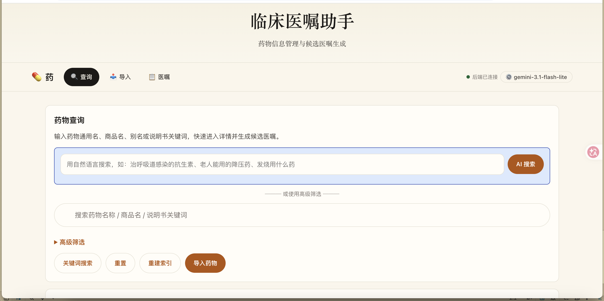
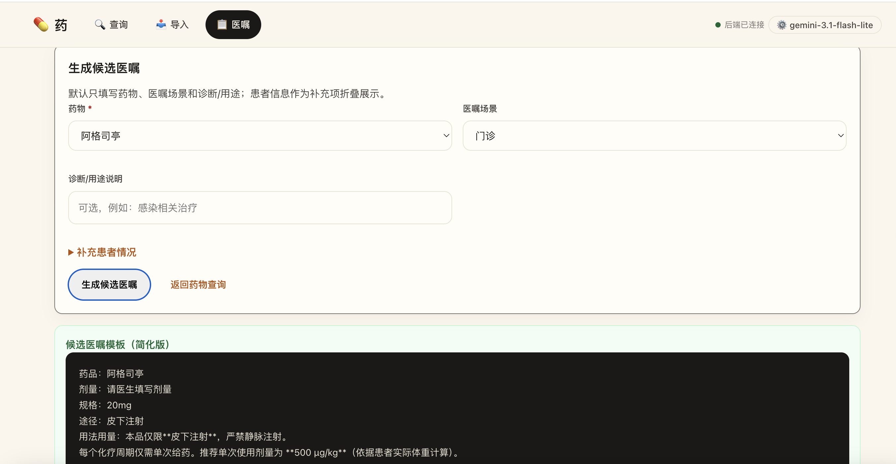

# Med Order Lite

`med-order-lite` 是一个本地运行的药物信息管理与候选医嘱生成 Web App。

它面向本地药物知识库维护场景，核心流程：

```
药物说明书 / 药物资料
  ↓
导入插件结构化
  ↓
生成标准 drug.md
  ↓
保存到本地药物库
  ↓
重建药物索引
  ↓
药物查询与候选医嘱生成
```

> ⚠️ 本系统只生成候选医嘱模板，不能替代医生判断，不能直接作为处方依据。所有药物信息和医嘱内容必须由医生或药师最终确认。

## 界面预览


*药物库首页 — 搜索、筛选、查看药物列表*


*药物详情页 — 查看说明书结构化字段、禁忌、注意事项*

---

## 技术栈

| 层级 | 技术 |
|---|---|
| 前端 | TypeScript + HTML + CSS |
| 后端 | Node.js + TypeScript |
| API | 本地 HTTP API |
| 药物数据库 | Markdown 文件，`drug.md` + JSON frontmatter |
| 查询索引 | `drugs.index.json` |
| 分类字典 | JSON 文件 |
| AI 接入 | OpenAI / Anthropic / DeepSeek / Google 等 LLM |
| PWA | 基础 manifest 和 service worker |

药物原始数据存放在 `server/kb/drugs/`。

---

## 环境要求

```
Node.js >= 20
npm >= 10
现代浏览器 Chrome / Edge / Safari / Firefox
```

检查版本：

```bash
node -v
npm -v
```

详细要求见 `REQUIREMENTS.md`。

---

## 第一次运行

```bash
npm install
npm install --prefix server
npm run build:all
npm run dev
```

然后打开：

```
前端：http://localhost:5173
后端：http://localhost:8787
健康检查：http://localhost:8787/health
```

`npm run dev` 会一直运行，停止时按 `Ctrl + C`。

> 💡 如果启动时提示 `EADDRINUSE: address already in use :::8787`，说明 8787 端口被占用，可以用以下命令杀掉占用进程：

```bash
lsof -ti:8787 | xargs kill -9
```

然后重新运行 `npm run dev`。


---

## 常用命令

| 命令 | 说明 |
|---|---|
| `npm install` | 安装根目录依赖 |
| `npm install --prefix server` | 安装后端依赖 |
| `npm run dev` | 同时启动前端和后端 |
| `npm run dev:web` | 只启动前端 |
| `npm run dev:api` | 只启动后端 |
| `npm run compile:all` | 编译前端和后端 |
| `npm run build:indexes` | 重建药物索引 |
| `npm run build:public-snapshot` | 生成前端离线快照 |
| `npm run build:all` | 编译 + 重建索引 + 生成快照 |
| `npm run validate:drugs` | 校验药物 Markdown 文件 |
| `npm run smoke:test` | 后端基础接口测试 |
| `npm test` | 运行单元测试 |

---

## 项目目录结构

```
med-order-lite/
├─ src/                         前端源码
│  ├─ api/                       前端 API 调用封装
│  ├─ components/                前端组件
│  ├─ pages/                     页面：药物库、导入、医嘱生成
│  ├─ types/                     前端类型定义
│  └─ utils/                     前端工具函数
│
├─ server/                       后端项目
│  ├─ src/
│  │  ├─ core/                   核心：路由、中间件、配置
│  │  ├─ modules/
│  │  │  ├─ drug-kb/             药物 Markdown 知识库读写、索引
│  │  │  ├─ drug-entry-plugin/   药物导入插件执行与保存
│  │  │  ├─ order-generator/     候选医嘱生成
│  │  │  ├─ taxonomy/            分类字典服务
│  │  │  └─ ai/                  AI 模块（LLM 接入、药品搜索、说明书解析）
│  │  ├─ plugins/                药物导入插件
│  │  │  ├─ label-text/          说明书文本导入
│  │  │  ├─ excel-csv/           Excel / CSV 批量导入
│  │  │  ├─ label-pdf/           PDF 说明书导入
│  │  │  ├─ label-ocr/           OCR 文本导入
│  │  │  ├─ manual-drug-md/      标准 drug.md 导入
│  │  │  └─ ai-label-text/       AI 辅助说明书解析导入
│  │  ├─ utils/                  后端工具函数
│  │  └─ server.ts               后端 API 入口
│  │
│  ├─ kb/                        本地文件型药物数据库
│  │  ├─ drugs/                  药物 drug.md 文件
│  │  ├─ taxonomies/             分类、剂型、给药途径、风险标签
│  │  ├─ indexes/                药物索引
│  │  ├─ schemas/                数据校验 schema
│  │  ├─ imports/                导入来源、临时数据
│  │  └─ backups/                备份目录
│  │
│  └─ scripts/                   构建索引、校验、快照脚本
│
├─ public/                       PWA 静态资源和离线快照
├─ docs/                         项目文档
├─ dist/                         前端编译产物
├─ index.html                    前端入口
├─ package.json                  根项目依赖和脚本
├─ REQUIREMENTS.md               环境和依赖要求
└─ README.md                     项目说明
```

---

## 核心功能

### 药物库

- 查看药物列表、搜索药物
- 按分类、剂型、给药途径筛选
- 查看药物详情、说明书结构化字段
- 查看药物来源和风险标签

数据：`server/kb/drugs/**/*.md`
索引：`server/kb/indexes/drugs.index.json`

### 药物导入

支持导入方式：

1. 说明书文本导入（`label-text`）
2. Excel / CSV 批量导入（`excel-csv`）
3. PDF 说明书导入（`label-pdf`）
4. 图片 / 扫描件 OCR 文本导入（`label-ocr`）
5. 标准 drug.md 导入（`manual-drug-md`）
6. AI 辅助说明书解析导入（`ai-label-text`）

### 候选医嘱生成

- 选择药物 + 场景 + 患者条件
- 基于说明书字段生成候选医嘱模板
- 显示禁忌、注意事项、相互作用、特殊人群提示
- 复制候选医嘱

### AI 智能导入

项目内置 AI 模块，支持接入多种 LLM 供应商辅助解析药品说明书：

- OpenAI
- Anthropic (Claude)
- DeepSeek
- Google (Gemini)
- 兼容 OpenAI 接口的其他供应商

相关文档：`docs/ai-smart-import-plan.md`

---

## 后端 API 概览

```
GET   /health

GET   /api/drugs
GET   /api/drugs/:id
GET   /api/drugs/:id/raw-md

GET   /api/taxonomies
GET   /api/plugins

POST  /api/drugs/import/label-text
POST  /api/drugs/import/csv
POST  /api/drugs/import/pdf
POST  /api/drugs/import/ocr
POST  /api/drugs/import/markdown
POST  /api/drugs/import/ai          # AI 辅助导入

POST  /api/orders/generate

POST  /api/indexes/rebuild
GET   /api/indexes/status

GET   /api/ai/settings               # AI 配置
POST  /api/ai/parse                  # AI 解析说明书
```

---

## 药物文件格式

每个药物一个 `drug.md`，使用 **JSON frontmatter**（不是 YAML）。

```md
---
{
  "id": "drug-example",
  "type": "drug",
  "status": "active",
  "names": {
    "generic_cn": "示例药物",
    "generic_en": "Example Drug",
    "brand_names": [],
    "aliases": []
  },
  "classification": {
    "system": "western_medicine",
    "primary_category": "anti_infective",
    "secondary_category": "cephalosporins_first_generation"
  },
  "forms": [
    { "dosage_form": "injection", "strength": "", "route": "iv_drip" }
  ],
  "risk_tags": ["allergy_check_required"],
  "sources": [],
  "review": {
    "review_status": "approved",
    "lifecycle": "active",
    "updated_at": "2026-05-20",
    "version": 1
  }
}
---
```

详细格式见 `docs/drug-md-format.md`。

---

## 文档索引

```
REQUIREMENTS.md                                      环境与依赖要求
docs/project-structure.md                            项目结构说明
docs/drug-md-format.md                               药物 Markdown 格式说明
docs/import-methods-and-plugins.md                   导入方式和插件说明
docs/import-plugins.md                               导入插件机制说明
docs/index-rebuild.md                                索引重建说明
docs/order-generation.md                             候选医嘱生成说明
docs/med-order-lite-drug-classification-system.md    新版药物分类系统
docs/classification-migration-report.md              分类迁移记录
docs/ai-import-todo.md                               AI 导入待办事项
docs/ai-smart-import-plan.md                         AI 智能导入计划
docs/README-old.md                                   旧版 README 备份
```

---

## GitHub

```
仓库地址：https://github.com/liqi3333/med-order-lite-v1
默认分支：main
```

克隆：

```bash
git clone https://github.com/liqi3333/med-order-lite-v1.git
cd med-order-lite-v1
```

---

## 安全边界

本系统只用于药物信息结构化管理和候选医嘱模板生成。

必须遵守：

- 不自动推荐药物
- 不替代医生判断
- 不直接作为处方依据
- 导入药物必须按本地正式说明书复核
- 候选医嘱必须由医生最终确认
